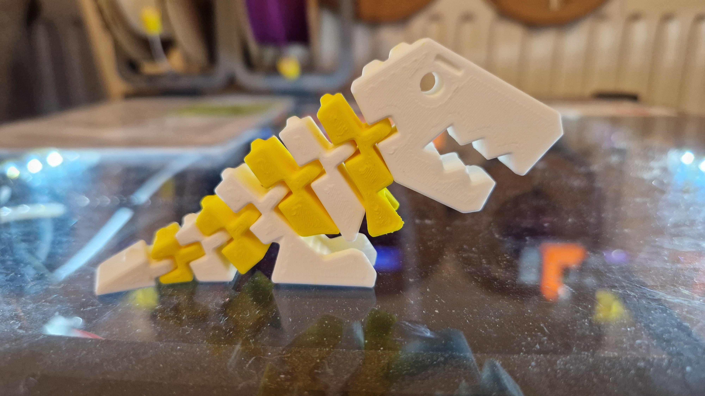
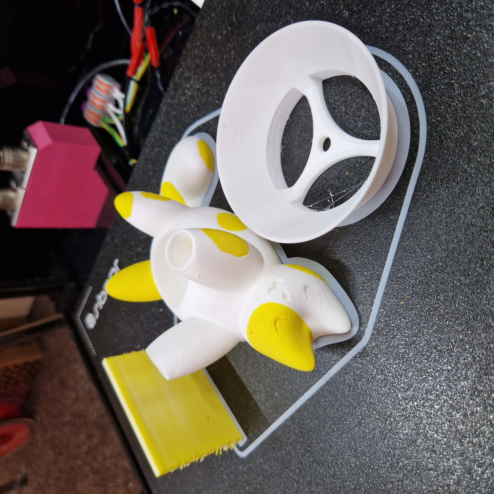
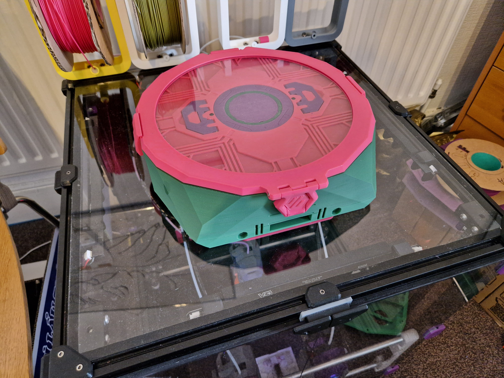

# MissChanger

A Stealth Burner tool-change system for Voron 2.4 and Trident.

## Description

MissChanger aims to be a tool-changing upgrade that is compatible with both Voron Trident and Voron 2.4 (Trident compatibility is pending). While also retaining the accuracy and reliability of the MGN9H tapping system of Voron-Tap.

Other features of MissChanger includes:

* The ability to quickly and toollessly convert between tool changer mode and single nozzle mode (for when you need the full print volume of the stock printer).

* Nozzle brush dock. For cleaning the ooze and build-up after tool-change.

## Compatibility

#### Printers:

- Voron 2.4 350 (up to 5 SBs)
- Voron 2.4 300 (up to 4 SBs)

For those who want to adapt MissChanger to you own system. The Bar-Ends are 28mm each, and each dock is 80mm in width. All will be riding in the grove of the 2020 aluminium extrusion frame.

#### Toolhead:

- Stealth Burner (up to 5, for the 350mm version) - v1

#### Hotend:

Any hot-ends that does not require a custom/extended main-body for the Stealth Burner should works just fine. Nevertheless, the follows are those that has been tested on the reference machine:

- Revo-Voron - Recommended.
  - It is officially supported for the Stealth Burner.
  - It has the the right amount of thermal mass to keep the nozzle temperature stable, while still have decent heat-up and cool-down time.
- Phaetus Dragon - Not recommended.
  - The heater block causing slow heat-up and cool-down. This is not ideal, since it is beneficial to lower the tool temperature when it is docked for a long period of time.
  - The cold side of the hot-end is inadequate to cool PLA in a 30°C+ chamber, eventually causing heat creep if the heater is constantly on.
  - Close proximity between the heater block to the plastic causing deformation. This does not resulted in critical failures, but the affected parts will not work on any other assembly.

#### Extruder:

All extruder that is compatible with the Stealth Burner should works just fine. Nevertheless, any added dimensions on top of the ClockWork 2 might resulted in less print area or space for other tool-heads.

1. v1:
* ClockWork 2 (CW2) - Default
  
  * All quoted clearance dimensions are in reference to this extruder.

* Galileo 2 Extruder (G2E)
  
  * The thumbscrew stick out ~8mm to the left. Thus, taking up more docking space than default.

## Assembly

BOM, STLs, and instructions for each version of are in their associated sub-folder in the [STL_Config_Instructions](./STL_Config_Instructions) folder (for the latest and relevant versions), or [MissChanger Archive](https://drive.proton.me/urls/3CDH12JTMW#YhJ5K3t4AadW) (for past versions).

## Software

The plugin for MissChanger is a fork of [klipper-toolchanger](https://github.com/viesturz/klipper-toolchanger), for [Tapchanger](https://github.com/viesturz/tapchanger), and it is available via GitHub at [VIN-y/klipper-toolchanger](https://github.com/VIN-y/klipper-toolchanger). MissChanger deviate greatly from the design of Tapchanger and Draftshift (Stealthchanger); thus, it's config files are not compatible upstream.

Installation and configuration steps are outlined in the [STL_Config_Instructions](./STL_Config_Instructions) folder. Sample config files and their descriptions are also available in the folder. 

### Recommended software:

- [KIAUH](https://github.com/dw-0/kiauh) - For the purpose of managing Klipper updates, to handle any potential incompatibility issues, whenever there is a major Klipper update.
- [Klipper-Backup](https://github.com/Staubgeborener/Klipper-Backup) - Klipper-Backup is a script for manual or automated GitHub backups. It's Lightweight, pragmatic and comfortable.

## Roadmap

### v1

- [x] ~~Lock in the Tap&Change and dock design for all future versions~~ - v1.1. is the final version for the Tap&Change system for the Stealth Burner
- [x] ~~Print capability test, material combination~~ - Tested with the three most common materials
- [x] ~~Compatibility with smaller Vorons~~ - Have been shown to be compatible with the Voron 2.4 300, via a different assembly configuration (shown in the manual), which should also be compatible with the 250 Vorons.
- [x] ~~USB tool-head support~~ - Nitehawk SB USB tool-head board.
- [ ] Trident compatibility

### v2

- [ ] Trident compatibility - v2 will be built directly on a Trident
- [ ] Support for additional tool-heads - TBD

## Other information

### Status definition

| Terms     | Description                                                                                  |
| --------- | -------------------------------------------------------------------------------------------- |
| Release   | Finalised. All relevant components and documentations are finished and tested.            |
| Beta      | All relevant components are locked in. However, without substantial testing or feedback. |
| Alpha     | CAD designs locked in. No (or incomplete) documentations.                                 |
| Bleeding  | Everything are subjected to changes.                                                         |
| Abandoned | Old design that is no longer being persuaded.                                                |

Note: 

* The .step and CAD project files for all but the most recent version will not be included in this repository, due to the storage/transfer limits of GitHub.

* With user feedback and further testing, the relevant version might be updated to the next tier. However, if significant changes are required, another version will be made and start at the bleeding state; and the current version will no longer be persuaded (i.e. abandoned).

## Recommendations

1. Keep tool-heads as similar as possible. 
   
   1. The more variations there are between tool-heads (i.e. control board, hot-end system, etc.), the more tuning will be need for each of them.
   
   2. Meaningful variants includes: extruder, nozzle size, nozzle material.

2. The following mods are not needed but is **recommended** to enhance the capability of MissChanger:
   
   1. [Calilantern Calibration Tool](https://vector3d.shop/products/calilantern-calibration) - MissChanger requires relatively high dimensional-accurate printed parts, to mate with each others. Therefore, it is recommended that you take the extra steps to calibrate your printer before starting the build.
   2. [Nevermore StealthMax](https://github.com/nevermore3d/StealthMax) - to regulate the chamber temperature, to allow PETG / PLA printing with the door closed; allowing them to be combined with ABS.
   3. [Spool Holder](https://www.printables.com/model/872144-spool-holder-for-2020-aluminium-extrusion) - to hold the spools on top of the machine. There are many ways to get this done, and it depends on the people's specific use-cases. The design linked here is just of my (the developer) own creation.
   4. [Inverted z-chain](https://www.printables.com/model/445298-inverted-z-chain-for-voron) - This is for the Voron 2.4 300mm, or smaller. To clear the space in front of the back gantry extrusion for the umbilicals.

3. The following mods are either **not recommended** or known to be not compatible with MissChanger:
   
   1. GE5C bearing z mount - This mod offer too much flexibility to the gantry, allowing it to sag when the z motors are disabled/un-powered. Nevertheless, it's inclusion will not cause catastrophic problems. You will just need to be careful. (I personally could not be bothered enough to remove mine) 
   
   2. Beefy front idlers - The cut off on the dock can only fit the stock front idlers.
   
   3. AWD - The cut off on the dock can only fit the stock front idlers.

## Sample

## Mods

Community members are encouraged to modify the the CAD where they see fit. They can contribute back to the project by either:

1. Creating a Pull Request, and add the modded files into the [UserMods](./UserMods) folder.

2. Reach out and send me the STEP files.

Modded items are not tested or officially supported. However, if it contains good ideas, it will be implemented into the official design down the line. The originator of the ideas will be included in the list bellow as a contributor.

... So, don't give yourself a weird name, please.

## Support

If you have any question, please FIRST check the [MissChanger Wiki](https://github.com/VIN-y/MissChanger/wiki)

If you still have any question, you can reach me at:

* `@vin` in the [Voron Toolchangers](https://discord.gg/qrb6HXNYxs) discord
* `@vinny_69 V2.6365` in the [VORONDesign](https://discord.gg/voron) discord
* [@vin-y.bsky.social](https://bsky.app/profile/vin-y.bsky.social) on Bluesky

## Contributors

* `@psychosis5150` in the [Voron Toolchangers](https://discord.gg/qrb6HXNYxs) discord
* `@pendorbound` in the [Voron Toolchangers](https://discord.gg/qrb6HXNYxs) discord
