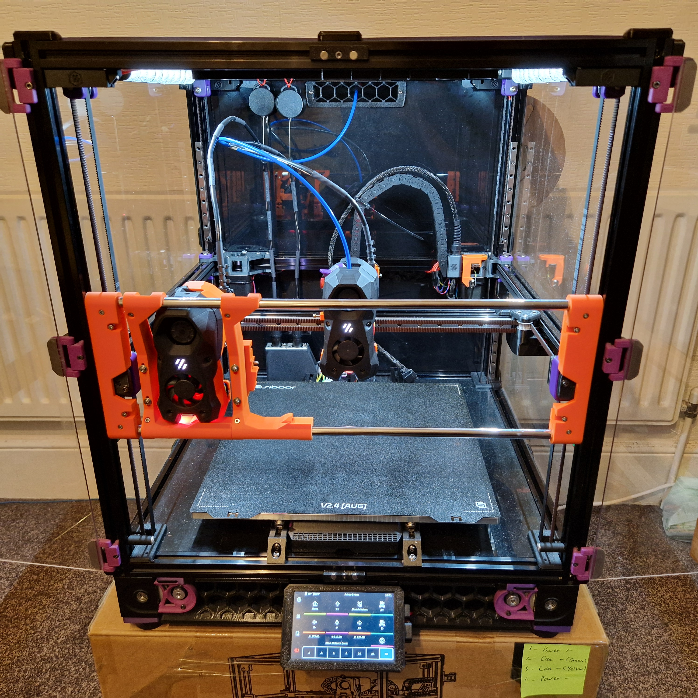

# MissChanger

A Stealth Burner tool-change system for Voron 2.4 and Trident.

This project was inspired by [Stealthchanger](https://github.com/Stealthchanger/Toolchanger), [TapChanger](https://github.com/viesturz/tapchanger/), and [Voron-Tap](https://github.com/VoronDesign/Voron-Tap/).

- The endstops assembly is a remix of that from [MrTeliP](https://www.printables.com/model/325765-voron-24r2-pg7-cable-gland-and-endstop).

- The exhaust cover is a remix of that from [Fiction](https://github.com/VoronDesign/VoronUsers/tree/main/printer_mods/Fiction/Exhaust_cover).

- The Nudge calibration switch is from [zruncho3d](https://github.com/zruncho3d/nudge).

## Description

MissChanger aims to be a tool-changing mechanism that is compatible with both Voron Trident and Voron 2.4. While also retaining the MGN9H tapping system of Voron-Tap.

This tool-changer have been tested to work fine, printing at 200mm/s and 5000mm/s^2. Nevertheless, speed is of no priority for this project.

At the moment, it is only compatible with: 

* Stealth Burner toolhead

* Revo-Voron hotend

* Voron 2.4 printer

## Assembly

Assembly steps are in the "STLs" folder.

The BOM only includes parts that are specific to this tool changer; and it is TBD.

## Software

This project use the same [toolchanger extension](https://github.com/viesturz/klipper-toolchanger/) and Klipper setup as [tapchanger](https://github.com/viesturz/tapchanger/).

Some config files are available in the **Software** folder. Nevertheless, they are not ready even for an alpha release. Further instructions are still TBD.

**DO NOT PROCESS UNLESS YOU KNOW WHAT YOU ARE DOING.**
