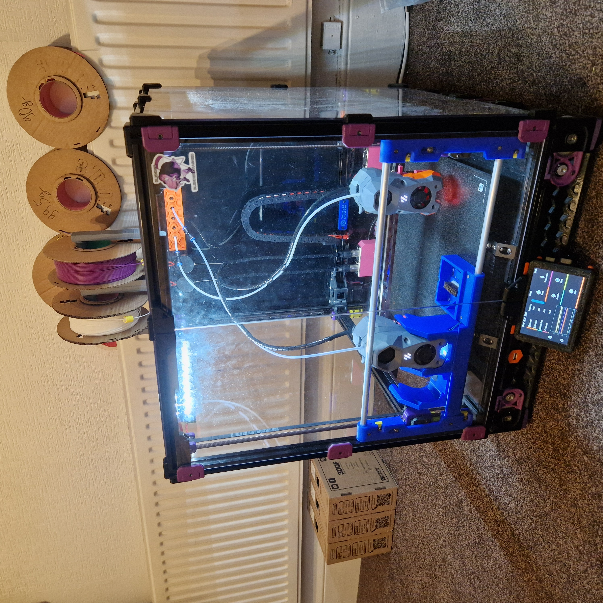

# MissChanger

A Stealth Burner tool-change system for Voron 2.4 and Trident.

* This project was inspired by [Stealthchanger](https://github.com/Stealthchanger/Toolchanger) and [TapChanger](https://github.com/viesturz/tapchanger/) 
- The Center_Tap for the Tap&Change system is from [Voron-Tap](https://github.com/VoronDesign/Voron-Tap/) 

- The endstops assembly is a remix of that from [MrTeliP](https://www.printables.com/model/325765-voron-24r2-pg7-cable-gland-and-endstop) 

- The exhaust cover is a remix of that from [Fiction](https://github.com/VoronDesign/VoronUsers/tree/main/printer_mods/Fiction/Exhaust_cover) 

- The Nudge calibration switch is from [zruncho3d](https://github.com/zruncho3d/nudge) 



## Description

MissChanger aims to be a tool-changing upgrade that is compatible with both Voron Trident and Voron 2.4 (Trident compatibility is pending). While also retaining the MGN9H tapping system of Voron-Tap. In addition, MissChanger is designed with the ability to quickly and toollessly convert between tool changer mode and single nozzle mode (for when you need the full print volume of the stock printer).

## Compatibility

#### Printers:

- Voron 2.4 printer

#### Toolheads:

- Stealth Burner toolhead (up to 5, for the 350mm version)

#### Hotends:

- Revo-Voron
- Phaetus Dragon

## Assembly

BOM, STLs, and instructions for each version of are in their associated sub-folder in the [STLs and Instructions](./STLs%20and%20Instructions) folder.

## Software

The plugin for MissChanger is a fork of [klipper-toolchanger](https://github.com/viesturz/klipper-toolchanger), for [Tapchanger](https://github.com/viesturz/tapchanger), and it is available via GitHub at [VIN-y/klipper-toolchanger](https://github.com/VIN-y/klipper-toolchanger). Installation and configuration steps are outlined in the [STLs and Instructions](./STLs%20and%20Instructions) folder.

Sample config files and their descriptions are available in the [Software](./Software) folder. MissChanger deviate greatly from the design of Tapchanger and Draftshift (Stealthchanger); thus, it's config files are not compatible upstream.

Other recommended software:

- [KIAUH](https://github.com/dw-0/kiauh) - For the purpose of managing Klipper updates, to handle any potential incompatibility issues, whenever there is a major Klipper update.

## Roadmap

### v1.[series]

- [ ] Lock in the Tap&Change and dock design for all future versions

- [ ] Trident compatibility (i.e. additional calibration probe mount design)

- [ ] Print capability test, material combination

### v2.[series]

- [ ] Regain lost z build volume - with a top hat

- [ ] Increase space between the toolhead and the front doors and compatibility with user mods - with a new dock that integrates into a "fridge door" of 20x20mm aluminium extrusion 

## Other information

### 1. Offset Types

There are 2 type of offsets for each tool-head:

- **x_offset** / **y_offset** / **z_offset** - which are the default offsets that most people are used to, which will be referred to as probe offset moving forward. They are sort of like hard-coded values (they are not); in that, they are pretty hard to work with downstream, i.e. in the configs

- **gcode_x_offset** / **gcode_y_offset** / **gcode_z_offset** - these are like for on-the-fly adjustment to for the gcode. This the stuff you adjust when you do baby-stepping mid-print

For the purpose of the tool-changer:

- **x_offset** and **y_offset** will not be used

- **z_offset** is to be calibrated for all toolheads

- **gcode_x_offset** / **gcode_y_offset** / **gcode_z_offset** are used to account for the XYZ different between the nozzles, based on a reference nozzle

### 2. X0-Y0 location

<mark>This is **an important point** to keep in mind.</mark> Other toolchanger projects might have done this differently. It is important to know how your build area is set up, to avoid collisions and potential damages.

MissChanger use the same build area configuration as the origin Voron 350mm, see the code block below. This build area set up stay the same between the single-toolhead  and the multi-toolheads mode, providing consistency. No matter which mode you are in, `G1 X{number} Y{number}`  will bring the gantry to the same spot above the build plate. Also, the creator's (that is me) finds negative coordinates confusing.

```
[stepper_x]
...
position_min: 0               # X-axis minimum travel - software limit
position_endstop: 350         # Mechanical reset point coordinates for X-axis (change to 350 for 350 models)
position_max: 350             # X-axis maximum travel - software limit (change to 350 for 350 models)
...

[stepper_y]
...
position_min: 0               # Y-axis minimum travel - software limit
position_endstop: 350         # Mechanical reset point coordinates for Y-axis (change to 350 for 350 models)
position_max: 350             # Y-axis maximum travel - software limit (change to 350 for 350 models)
...
```

Nevertheless, this behaviour can be change in the config, by bring the settings for `[stepper_x]` and `[stepper_y]` under the `Session Variables` section.

## Recommendations

1. Keep toolheads as similar as possible. - The more variations there are between toolheads (i.e. control board, hotend system, etc.), the more tuning will be need for each of them.

2. The following mods are either not recommended or known to be not compatible with MissChanger:
   
   1. GE5C bearing z mount - This mod offer too much flexibility to the gantry, allowing it to sag when the z motors are disabled/un-powered.
   
   2. Beefy front idlers - The cut off on the dock can only fit the stock front idlers.
   
   3. AWD - The cut off on the dock can only fit the stock front idlers.

## Support

If you have any question, you can reach me:

* `@vin` in the [Voron Toolchangers](https://discord.gg/Gt5XCCwv) discord
