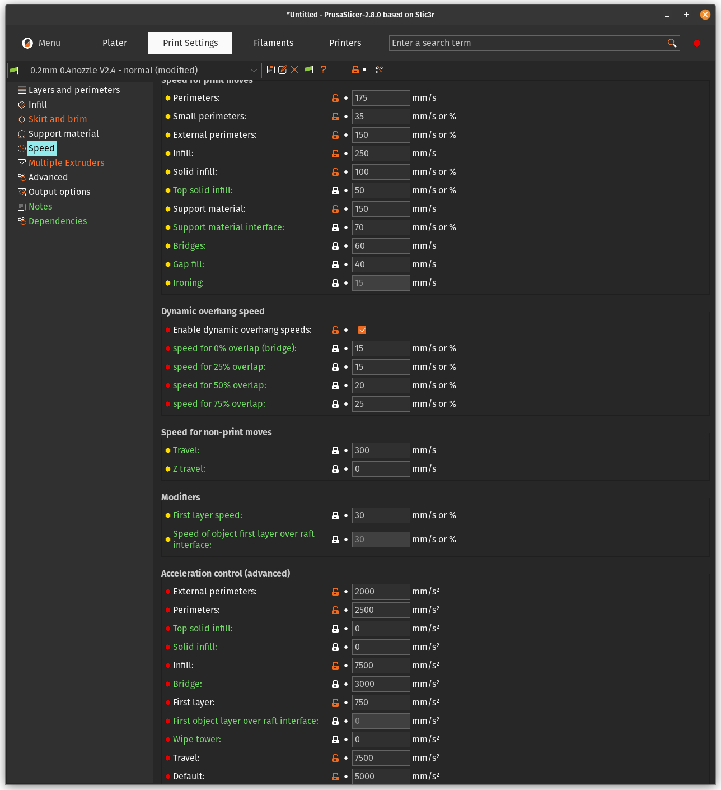

# 1. Introduction

Although the setting up the config for MissChanger will change some aspects of your printer, it is still recommended that you start the project with a functional printer with Voron-Tap, then add MissChanger and one tool-head at a time.

This document will not guide you through the set up of CAN bus or the physical mounting of the related hardware (i.e. U2C and tool-head board), please refer to the manufacture’s manual for that.

# 2. Hardware

## 2.1. MissChanger Core Assembly

The following manual is for the core components that are needed to get MissChanger up and running.

MissChanger Assembly Manual: [MissChanger_Assembly_Manual](./MissChanger_Assembly_Manual.pdf).

## 2.2. Situational / Optional / Mods

These following attachments are extras that will expand the capability of tool-changer system. Nevertheless, they were developed by others and does not share the same design language as MissChanger (i.e. difference print parameters).

| Mod                                                                                                                            | Description                                                                                                                   |
| ------------------------------------------------------------------------------------------------------------------------------ | ----------------------------------------------------------------------------------------------------------------------------- |
| [Nevermore Stealth Max](./6_Optionals/Nevermore_StealthMax)<br> + [DC Barrel Panel Mount](./6_Optionals/DC_Barrel_Panel_Mount) | - With modded flow chamber<br>- Cable management for Nevermore Stealth Max                                                    |
| [Galileo 2 + LDO Nitehawk SB USB cable strain relief](./5_Others/G2E-umbilical_anchor)                                         | For Galileo 2 + LDO Nitehawk SB USB                                                                                           |
| [Inverted z-chain](https://www.printables.com/model/445298-inverted-z-chain-for-voron)                                         | Recommended for the Voron 2.4 300mm, or smaller. To clear the space in front of the back gantry extrusion for the umbilicals. |

# 3. Software

This section aims to provide a guide through the installation process of the software and setup the config.

## 3.1. Installation

To install the [klipper-toolchanger](https://github.com/VIN-y/klipper-toolchanger) plugin, run the following installation script using the following command over SSH. This script will download this GitHub repository to your RaspberryPi home directory, and symlink the files in the Klipper extra folder.

Before installation. For those who are switching branch. You will need to run the following commands to clean out the old files before installing. Alternatively, you can run the uninstall script in below, in **section 3.1.2**.

```
cd ~
rm -rf klipper-toolchanger/
```

### 3.1.1. Install

1. For normal use: (TBD)

```
wget -O - https://raw.githubusercontent.com/VIN-y/klipper-toolchanger/main/scripts/install.sh | bash
```

2. For Beta test: (TBD)

```
wget -O - https://raw.githubusercontent.com/VIN-y/klipper-toolchanger/beta/scripts/install.sh | bash
```

3. For Alpha test:

```
wget -O - https://raw.githubusercontent.com/VIN-y/klipper-toolchanger/alpha/scripts/install.sh | bash
```

*Note 1: You will need a `FIRMWARE_RESTART` whenever there is an update for the add-on.*

### 3.1.2. Uninstall

Some manual change will still need to be done in the user space (i.e. the section that is accessible via the web interface). This includes:

* The `config` folder

* The `misschanger_settings.cfg` file

* Irrelevant tool-head config file

* Irrelevant settings in `printer.cfg`

* `moonraker.conf` registry

These settings / files / folders tend to contain information and calibration values specific to your printer. Thus, it advised that you create a backup before deletion.

To fully uninstall the back-end, run one of the following command over SSH. Make sure to select the link that is relevant to the version that is currently install on the printer.

1. For normal use: (TBD)

```
wget -O - https://raw.githubusercontent.com/VIN-y/klipper-toolchanger/main/scripts/uninstall.sh | bash
```

2. For Beta test: (TBD)

```
wget -O - https://raw.githubusercontent.com/VIN-y/klipper-toolchanger/beta/scripts/uninstall.sh | bash
```

3. For Alpha test:

```
wget -O - https://raw.githubusercontent.com/VIN-y/klipper-toolchanger/alpha/scripts/uninstall.sh | bash
```

## 3.2. Configuration

The **sample configuration files** can be found in the [Klipper_Config](./Klipper_Config) folder, where further descriptions of the software stack can also be found.

If you are comfortable with it, you are welcome to by-pass the default macros and play with the configs files to your liking, following **step -1**. If you found any errors or room  for improvement, feel free to reach out to me to get it fixed, via a GitHub or otherwise.

Nevertheless, the following are the recommended steps to get the software up-and-running using the default set of macros. Following the guide (starting from **step 1**) bellow will make it easier for you to get support. The default macros will be managed and updated together with the software stack.

### Step -1: Customisation

For building your custom macro:

1. Check where the relevant macro is saved, using the [code stack breakdown](./code_stack_breakdown.pdf) 

2. Download the relevant macro config file, in the [klipper-toolchanger](https://github.com/VIN-y/klipper-toolchanger/tree/main/macros) repository (or straight from your web interface)

3. Imported the config file back using the web interface

4. `inlcuded` it back into **printer.cfg** 

5. Comment-out (or delete) the reference to the file that the new config replaces, in **printer.cfg**

6. Save and Restart

7. Start editing the file to your liking

### Step 1: Back-up your running system

Through your web interface:

1. Select all of your config files

2. Download it to your computer

### Step 2: Set up printer.cfg

You can check the sample **printer.cfg** in [Klipper_Config](./Klipper_Config) folder as reference. However, be careful of copy-paste directly from there, because there are variables that might incompatible with yours printer. The following code blocks will intentionally have all optional functionalities (i.e. nozzle cleaning, active chamber thermal control, exhaust fans, etc.)

1. `includes` the following at the start of the **printer.cfg** file.

```
## Linked default marcros
[include misschanger_macros/config_switch.cfg]
[include misschanger_macros/homing.cfg]
[include misschanger_macros/nozzle_clean.cfg]
[include misschanger_macros/overwrite.cfg]
[include misschanger_macros/print_time_default.cfg]
[include misschanger_macros/tool_calibrate.cfg]
[include misschanger_macros/toolchanger.cfg]
## misschanger settings
[include misschanger_settings.cfg]
```

Optional:

```
[include misschanger_macros/tool_calibrate_extra.cfg]    # For the Nudge probe
```

2. Add **Global Variables**.

Each variable has been given a short description on what they do and some variable can be used to disable functionalities, such that you will not need to comb through the configs to find and edit them out.

```
####################################################################################
##                             Global Variables
####################################################################################
[config_switch]
#--------------------------------------------------------------------
[gcode_macro _static_variable]
description: Global static variables that is used through out the configs
## Tool-head calibration
variable_calibration_probe_x: 242.237500     # X aproximate position of the Nudge probe. CHANGE TO MATCH YOUR SET-UP
variable_calibration_probe_y: 329.825000     # Y aproximate position of the Nudge probe. CHANGE TO MATCH YOUR SET-UP
variable_calibration_safe_z: 60.00           # Z aproximate safe position of the Nudge probe. KEEP CONSERVATIVE TO AVOID COLLISION
variable_calibration_min_z: 40.00            # Z aproximate probe position of the Nudge probe.
variable_calibration_abs_z_seperately: 0     # "0" = False / "1" = True. For, the Nudge probe this should be '1'
variable_final_lift_z: 3                     # This must be the same as "final_lift_z" in [tools_calibrate] in misschanger_settings.cfg
## Cleaning dock
variable_clean_dock_x: 0                     # X aproximate position of the cleaning dock. CHANGE TO MATCH YOUR SET-UP. Set to "0" to disable
variable_clean_temp: 200                     # Nozzle clean temperature
variable_clean_threshold: 125.0              # The minimum perimeter of the print, below which the printing material will not be considered
## Always on crash detection
variable_alway_on_crash_detection: 1         # "0" = False / "1" = True
## For heatsoak macro
variable_heatsoak_temp: 0                    # Chamber temperature target for heat soak. REQUIRES [temperature_sensor Chamber] below. Set to "0" to disable
## Dynamic thermal expansion compensation
variable_thermo_expand_offset: -0.080        # Maximum z offset for thermal expansion compensation. REQUIRES [temperature_sensor Chamber] below
variable_thermo_expand_temp_high: 70         # Chamber temp to apply maximum z offset for thermal expansion compensation. REQUIRES [temperature_sensor Chamber]
variable_thermo_expand_temp_low: 0           # Chamber temp start applying thermal expansion compensation. REQUIRES [temperature_sensor Chamber]. Set to "0" to disable
gcode:                                       # This is here to appease klipper
```

3. Add the **Section Variables** section.

These sections need to be placed just before the **SAVE_CONFIG** section, as shown in the sample **printer.cfg**. Everything below the `Section Variable marker` will be swap in and out upon `A_CONFIG_TOGGLE`.

If a function settings were already existing somewhere else, the old function will need to be removed, or transfer to the new location. The critical settings that needs to be changed are as follow:

- `[quad_gantry_level]`, increase the y position of the front 2 `points:` to `130`, as shown, to avoid crashing into the dock.
- `[bed_mesh]`, make sure that `mesh_min: 30,130` , as shown, to avoid crashing into the dock.
- `[gcode_macro _home]` need to adjusted with the appropriate `xh` and `yh` which represent the centre of the built area.
- `variable_dock` is the indicator of which config is being used, is to be toggled in and out. 

```
####################################################################################
##                          Session Variables
####################################################################################
#;<    # Section Variable marker
#---------------------------------------------------------------
[include ./T0-SB2209-Revo-LDO.cfg]
[include ./T1-SB2209-Revo-LDO.cfg]
[include ./T2-Nitehawk-Revo-G2E.cfg]
[include ./T3-Nitehawk-Revo-LDO.cfg]
#---------------------------------------------------------------
[gcode_macro _home]
variable_xh: 175.0
variable_yh: 235.0
variable_safe_z: 60.0
# Dock is installed: True or False
variable_dock: True
gcode:
#---------------------------------------------------------------
[bed_mesh]
speed: 200                   # Calibration speed
horizontal_move_z: 10        # Z-axis movement speed
mesh_min: 30,130             # Minimum calibration point coordinates x, y
mesh_max: 320, 320           # Maximum calibration point coordinates x, y. 350mm=320,320
probe_count: 11,11           # Number of sampling points (7X7 is 49 points)
mesh_pps: 2,2                # Number of supplementary sampling points
algorithm: bicubic           # algorithmic model
bicubic_tension: 0.2         # Algorithmic interpolation don't move
#---------------------------------------------------------------
[quad_gantry_level]
#    Gantry Corners for 350mm Build
gantry_corners:
    -60,-10
    410,420
#  Probe points for 350mm Build
points:
    50,130
    50,300
    300,300
    300,130

speed: 150                   # Levelling speed
horizontal_move_z: 15        # Z-axis starting height
retries: 10                  # Number of out-of-tolerance retries
retry_tolerance: 0.0075      # Sampling tolerance
max_adjust: 20               # Maximum adjustment stroke for levelling
```

4. If it exist in **printer.cfg**, disable `[safe_z_home]` (comment-out or delete)

5. Add relevant variable under **SAVE_CONFIG**.

`[tool_probe T0]` and  `[extruder]` is needed no matter what your setup is. As, it is the reference / default tool-head.

For each additional tool-head, you will need an associated set of  `[tool t(x)]`, `[tool_probe T(x)]`, and `[extruder(x)]`. **It is recommended** to add and test the tool-head, one at a time.

*NOTE 1: Your printer will be throwing error beyond this point, until the software is fully setup.* 

*NOTE 2: The variables in this section will need to be calibrated to match your hardware.* 

```
#*# [tool_probe T0]
#*# z_offset = -0.600000
#*#
#*# [extruder]
#*# control = pid
#*# pid_kp = 35.987
#*# pid_ki = 4.284
#*# pid_kd = 75.574
#*#
#*# [tool T1]
#*# gcode_x_offset = 0.259375
#*# gcode_y_offset = 0.256250
#*# gcode_z_offset = 0.490000
#*#
#*# [tool_probe T1]
#*# z_offset = -0.738
#*#
#*# [extruder1]
#*# control = pid
#*# pid_kp = 33.912
#*# pid_ki = 3.325
#*# pid_kd = 86.477
#*#
#*# [tool T2]
#*# gcode_x_offset = 0.087500
#*# gcode_y_offset = 0.912500
#*# gcode_z_offset = 0.207500
#*#
#*# [tool_probe T2]
#*# z_offset = -1.173
#*#
#*# [extruder2]
#*# control = pid
#*# pid_kp = 27.329
#*# pid_ki = 1.804
#*# pid_kd = 103.505
#*#
#*# [tool T3]
#*# gcode_x_offset = 0.156250
#*# gcode_y_offset = 0.925000
#*# gcode_z_offset = 0.080000
#*#
#*# [tool_probe T3]
#*# z_offset = -1.2105
#*#
#*# [extruder3]
#*# control = pid
#*# pid_kp = 34.630
#*# pid_ki = 3.785
#*# pid_kd = 79.217
```

### Step 3: Make the reference tool-head config file

Use the `T0-SB2209-Revo-LDO.cfg` as references.

1. Transfer the items relating to the tool-head from your `printer.cfg` to a separate file:
   
   * `[mcu EBBCan0]` - the MCU for your tool-head, named to your liking, i.e. EBBCan0.
   
   * `[adxl345]` - The accelerometer on the tool-head.
   
   * `[resonance_tester]` 
   
   * `[temperature_sensor]`
   
   * `[extruder]`
   
   * `[tmc2209]` - that is associated extruder motor
   
   * `[verify_heater]`
   
   * `[heater_fan]`
   
   * `[neopixel]` - if applicable
   
   * `[tool_probe]` 
     
     * <mark>!!!NOTE!!!</mark> that the `activate_gcode:` for the item has been replace with the macro `_TAP_PROBE_ACTIVATE`, with the flag `HEATER=extruder`. This flag <mark>NEED TO BE SET TO THE RIGHT "EXTRUDER"</mark>. Failure to do so, may result in damage bed surface.

2. Replace `[fan]` with `[fan_generic T0_partfan]`

3. Add the following item and macro:
   
   * `[gcode_macro T0]` - for tool switching
   
   * `[tool T0]` - associate the items above to T0 and provide tool specific variables (which will need to be adjusted later).

4. Include tool-head config in the session variables are in `printer.cfg`, as shown in the code block in **Step 2.3**.

*Note: At this point, the printer should be able to have a firmware restart without (or with minor) errors.* 

### Step 5: Calibrate and test T0

1. Remove the dock and any attached tool-head other than T0 (for safety reason).

2. Run `FIRMWARE_RESTART`, and fix any problem that arise ;)

3. Run `G28` and `QUAD_GANTRY_LEVEL` 

4. Check that:
   
   * The printer home Y before X
   
   * Quad gantry level front points are at Y130
   
   * Extruder PID is correctly set and applied (no error / no bouncing temperature)

5. Re-mount the dock

6. Calibrate extruder `rotation_distance`

7. Calibrate heater PID

8. Calibrate the park position, see **section 4.1.** 

9. Calibrate the `z_offset`, see **section 4.3.** 

10. (optional) Calibrate input shaper, see **section 4.2.** 

11. Save & Restart

### Step 6: Make the next tool-head and its config file

1. Follow the hardware assembly guide from the manufacture of the relevant hardware, i.e extruder, tool-head board, etc.

2. Mount the dock and temporary mount the new tool-head to the dock.
   
   <mark>CAUTION:</mark> **DO NOT** try to make the print pick up the tool yet.

3. Use `T1-SB2209-Revo-LDO.cfg` (and others) config file as references. Make, calibrate, and test the config files for the other tool-heads.

4. Include tool-head config in the session variables are in `printer.cfg`, as shown in the code block in **step 2.3**.

5. Copy and paste the associated set of `[tool t(x)]`, `[tool_probe T(x)]`, and `[extruder(x)]` to the **SAVE_CONFIG** section, if they are not already there.

6. Save & Restart

### Step 7: Calibrate and test tool-head

If this is the first tool-head you made beside the reference tool-head. Then you will need to test the max available y of your set up:

1. Run `G28`

2. Manually nudge the tool-head to right behind a docked tool (via the web interface), but not touching

3. Note down the Y position of that location

4. If the y location is greater than 120 mm, then you will need to update the `params_safe_y` in `[toolchanger]` in `misschanger_settings.cfg`

5. Save & Restart

Otherwise:

1. Calibrate extruder `rotation_distance`

2- Calibrate heater PID

3. Save & Restart

4. Run `G28` and `QUAD_GANTRY_LEVEL`

5. Calibrate the park position, see **section 4.1.** 

6. Calibrate the `z_offset`, see **section 4.3.** 

7. (optional) Calibrate input shaper, see **section 4.2.** 

### Step 8: Other macros

* `macro-general.cfg`

* `macro-test.cfg`

These configs tends to be points of customisation for many. Therefore, the included files are intended to be inspirations for your own macros. They contains commands and functionalities that may not be needed or are relevant to your printer.

### Step 9: Single tool-head config

1. Run `SAVE_CONFIG_MODE` to save the current setup.

2. Check if the save was made correctly, in the **config** folder.

3. In the Section Variable section in **printer.cfg**:
   
   1. Comment out all included tool-head configs other than T0
   
   2. Under `[gcode_macro _home]`:
      
      1. Set an appropriate `xh` and `yh` which represent the centre of the new built area.
      
      2. Set `variable_dock` to `False`
   
   3. Revert to `[bed_mesh]` and `[quad_gantry_level]` to the original values of the stock machine (without the tool-changer bits)
   
   4. Delete the all `[tool T(x)]`, `[tool_probe T(x)]`, and `[extruder(x)]` under the `SAVE_CONFIG` section. EXCEPT: `[tool_probe T0]` and `[extruder]`.

4. Save, but no restart is needed.

5. Run `SAVE_CONFIG_MODE` and check if the file is correctly saved.

Now, the `CONFIG_TOGGLE` macro will allow you to toggle between these 2 configs. 

# 4. Calibration

This section assumes that the new tool-head has been assembled, wired up, and has been recognised by Klipper.

## 4.1. Park position calibration

1. Run `G28` and `QUAD_GANTRY_LEVEL`  - if not already done

2. Run `G1 Z150 F9000` 

3. Run `STOP_TOOL_PROBE_CRASH_DETECTION` 

4. On the web interface, in `Setting > Control` add `0.1` and remove `100` in the `Move distance increments X & Y axes (in mm)` 
   
   *Note: This is temporary for this step only, and can be reverted later.*

5. Set the dock at the empty position, i.e. at the bottom of the ramp.
   

6. Use the web interface, nudge the tool-head into the correct x-position. This can be tested by nudging the y-position in and out to see which side of the tool-head touch the dock first. Then adjusts it, such that both side of the dock would touch the tool-head at the same time.
   

7. Copy and paste the current x-coordinate into the `params_park_x:` of the config file of the current tool-head

8. Save it, **BUT DON'T RESTART**

9. Nudge the y-position until the dock is at the peak of the ramp. - The dock is tough enough to handle a bit of pressure from the gantry. So you can keep nudging the y-position until the dock flex a bit, then back it off.

10. Run:
    
    ```
    G91
    G1 Y+80 F6000
    G90
    ```

11. Copy and paste the current y-coordinate into the `params_park_y:` of the config file of the current tool-head

12. Save it

13. Run `FIRMWARE_RESTART`

14. Run the `TEST_DOCKING` macro

## 4.2. Input Shaper (optional)

*Note: To avoid Klipper from throwing errors, the parameters for input shaper are pre-populated in* `toolchanger.cfg` *and in each tool-head config files. Nevertheless, it is best to calibrate it for each available tool-head.*

1. Enable (un-comment) the `[adxl345]` and `[resonance_tester]` in the config of the tool-head that is to be calibrated

2. Disable (comment out) the `[adxl345]` and `[resonance_tester]` in the config of the other tool-heads

3. Save & Restart

4. Mount the tool-head that is to be calibrated

5. Run `G28` and `QUAD_GANTRY_LEVEL`

6. Run `SHAPER_CALIBRATE` - **BUT, DO NOT SAVE**

7. From the console output, save the following parameters into the tool-head config (at the bottom of the `[tool Tx]` section)
   
   ```
   params_input_shaper_type_x: ...
   params_input_shaper_freq_x: ...
   params_input_shaper_damping_ratio_x: ...
   params_input_shaper_type_y: ...
   params_input_shaper_freq_y: ...
   params_input_shaper_damping_ratio_y: ...
   ```

8. Save & Restart

## 4.3. Calibrate Offsets

### 4.3.1. Calibrate Reference Z-Offset

1. Mount tool-head T0

2. Go to T0 config file. Make sure:
   
   - `z_offset` under `[tool_probe T0]` is commented out
   
   - Every other offsets to `0`; i.e. `x_offset` and `y_offset`
   
   - Save it, **BUT DON'T RESTART** 

3. Run `G28` and `QUAD_GANTRY_LEVEL` 

4. Run `PROBE_CALIBRATE` on the console and go through the process with the normal paper test

5. Run `SAVE_CONFIG` - which will restart your printer

6. Go to `printer.cfg`

7. Copy the z-offset value from:
   
   ```
   #*# [tool_probe_endstop]
   #*# z_offset = {value}
   ```
   
   And, paste it to:
   
   ```
   #*# [tool_probe T0]
   #*# z_offset = {value}
   ```

8. Delete:
   
   ```
   #*# [tool_probe_endstop]
   #*# z_offset = {value}
   ```
   
   *Note: It will not be used regardless of whether it is there or not.*

9. Save & Restart

*Note: It is key that you get the z_offset correct for the T0, as it will be used to extrapolate other offsets later on. Therefore, it is worth diverge from the instruction, if you have a preferred way to set your the z-offset.*

### 4.3.2. Calibration Probe Setup

At this stage, you should have:

- The Nudge probe assembled, tested, and installed

- T0 z-offset calibrated

This section will guide you through the calibration of the machine specific variable `trigger_to_bottom_z`, which will allow you to automate the z-offset of the tool-heads that are not T0. 

*Note: This should be your go to variable to adjust whenever you ran into z-offset issue.*

### Setup:

1. Open `misschanger_settings.cfg`

2. Setup `[tools_calibrate]` with the correct `pin`

3. Save and restart

4. Open `printer.cfg` 

5. Set the approximate X and Y location of the Nudge pin in `[gcode_macro _static_variable]` 

6. Save and restart

### Steps:

1. Go to `printer.cfg` and record the `z-offset` for `[tool_probe T0]`, which should be at (or near) the bottom of the file

2. Mount tool-head **T0** and make sure it's nozzle is clean

3. Run `G28` and `QUAD_GANTRY_LEVEL`

4. Mount the calibration probe

5. Run `CALIBRATE_TRIGGER_BOTTOM`

6. Copy the proposed offset on the console to the `trigger_to_bottom_z:` in `[tools_calibrate]`.

7. Save and restart

8. Run `CALIBRATE_OFFSETS TOOL=0` - But, **DON'T RESTART**

9. Check if proposed z-offset to be +-0.01mm of the recorded `z_offset` in **step 1**.

10. Run `CALIBRATE_OFFSETS TOOL=0` 2-3 more times to make sure the measured value is consistence.

Your calibration probe is ready.

*Note: It is worth mentions that there are other ways to calibrate your offsets, such as the visual based solution from [Ember](https://www.emberprototypes.com/products/cxc) or the calibration print that you can get from [Printables](https://www.printables.com/model/201707-x-y-and-z-calibration-tool-for-idex-dual-extruder-). Each with their pros and cons, in term of accuracy and cost. However,  a physical contact probe is currently the only way to automatically calibrate all relevant offsets.*

### 4.3.3. Other tool-head(s)

### Steps:

1. <mark>**!!! MAKE SURE THE CALIBRATION PROBE IS NOT MOUNTED !!!**</mark>

2. Make sure all tool-heads are cold (near room temperature)

3. Make sure all nozzles are clean

4. Make sure all tool-head config file (except T0) has the following variable disabled (commented out):
   
   - `gcode_x_offset` 
   
   - `gcode_y_offset` 
   
   - `gcode_z_offset` 
   
   - `z_offset` 

5. Save it, **BUT DON'T RESTART**

6. Mount tool-head T0

7. Run `G28` and `QUAD_GANTRY_LEVEL`

8. Mount the Nudge probe

9. Run `CALIBRATE_OFFSETS` - the process is automatic, but you can specify a specific tool-head

10. Run `SAVE_CONFIG`

If you has the set `variable_calibration_abs_z_seperately` to `1` in `[gcode_macro _static_variable]` in **printer.cfg** (for the Nudge probe).

1. Mount tool-head T0

2. Run `G28` and `QUAD_GANTRY_LEVEL` 

3. Run `CALIBRATE_ABSOLUTE_Z` 

4. Run `SAVE_CONFIG`

# 5. Test and Troubleshoot

## 5.1. Offsets

It is important to test if the `z_offset` and `gcode_z_offset` are set-up and applied correctly. A miss-configured `z_offset`/`gcode_z_offset` can cause the nozzle to be dragged on the bed, risking damage. Please follow the steps below to test the config, before you start printing.

### Part 1: Check the z_offset of T0

1. Make sure the printer is cold (near ambient temperature).

2. Run `G28` and `QUAD_GANTRY_LEVEL` with T0

3. Run `G1 X175 Y235 Z10 F9000` (centre of print area)

4. Run `G1 Z0 F9000` 

5. Test the z-offset with the paper test. - If it is good then you set-up `trigger_to_bottom_z` correctly.

6. If it does not work:
   
   1. baby step the z position to correction.
   
   2. adjust `trigger_to_bottom_z` accordingly using the baby stepped amount.
   
   3. then, rerun `CALIBRATE_OFFSETS TOOL=0`.
   
   4. retry step 1 to 4.

### Part 2: Check the gcode_z_offset of the other tools

1. Goes through step 1 and 2 of part 1, above.

2. Switch to next tool, via the web UI or Klipper Screen.

3. Goes through step 3 to 6 of part 1, above.

4. If it does not work. rerun `CALIBRATE_OFFSETS TOOL=[x]` for that tool-head (or all of them).

### Part 3: gcode_x_offset and gcode_y_offset

To validate `gcode_x_offset` and `gcode_y_offset`, you just need to print something and see if they are set-up and applied correctly. Alternatively, you can also buy and use [Ember Camera Assisted XY](https://www.emberprototypes.com/products/cxc) to validate them.

# 6. Tool-change Tuning

The speed and path of the default tool-change routine, in `misschanger_settings.cfg` is not tuned for reliability. It is slower and has more steps than needed. The `params_path_speed` can be increased and some of the "Wiggle wiggle", in the path, can be disable. For example:


# 7. Slicer Profile

## Custom Start G-code

Copy and paste the following code into your slicer.

*Note: It need to stay as a single line of gcode.*

```
PRINT_START BED_TEMP=[first_layer_bed_temperature] FIRST_LAYER_PRINT_SIZE=[first_layer_print_size] FIRST_LAYER_HEIGHT=[first_layer_height] TOOL=[initial_tool] TOOL_TEMP={first_layer_temperature[initial_tool]} {if is_extruder_used[0]}T0_TEMP={first_layer_temperature[0]} T0_Fil={filament_type[0]}{endif} {if is_extruder_used[1]}T1_TEMP={first_layer_temperature[1]} T1_Fil={filament_type[1]}{endif} {if is_extruder_used[2]}T2_TEMP={first_layer_temperature[2]} T2_Fil={filament_type[2]}{endif} {if is_extruder_used[3]}T3_TEMP={first_layer_temperature[3]} T3_Fil={filament_type[3]}{endif}
```


Also. Disable the following option:


## Slicer Bed Shape

The printer bed shape need to be set as shown below, to avoid collisions with the dock during printing.

Depending on the umbilical mounting solution on the tool-head side, the lost y can be between 120mm to 140mm.

*Note: It can be seen here that the max print height was set to 235mm. This is recommended for new machines to avoid umbilical tangling. However, if you are willing to do some tuning to the tension of the umbilical or add a top hat to the system, the max print height can be increased to 250mm or 300mm.*

### For printers with 350mm beds:


### For printers with 300mm beds:


## Multiple Extruder

Enable **Ooze Prevention**.

This setting will allow you to reduce the docked nozzle temperature, to prevent over cooking the filament.

Even if you don't want it to drop the temperature, still enable it, then set the `Temperature variation` to 0°C or 1°C. This setting will emit a nozzle heating command after tool-change, effectively act as reheat command for when the system is recovering from a failed tool-change.


## Speed profile

Although, you might want to tune your own speed profile for the best performance. Here is a slow and reliable profile to get you started with.


