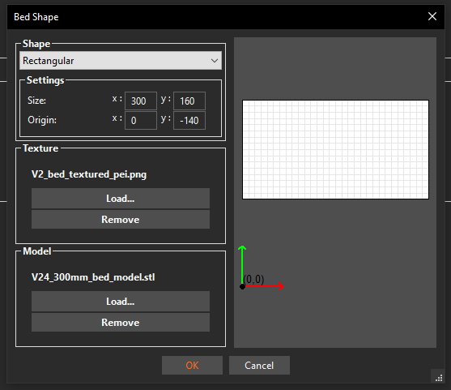

# V1.2

## 1. Introduction

Although the setting up the config for MissChanger will change some aspects of your printer, it is still recommended that you start the project with a functional printer with Voron-Tap, then add MissChanger and one tool-head at a time.

This document will not guide you through the set up of CAN bus or the physical mounting of the related hardware (i.e. U2C and tool-head board), please refer to the manufacture’s manual for that.

## 2. Hardware

### 2.1. MissChanger Core Assembly

The following manual is for the core components that are needed to get MissChanger up and running.

MissChanger Assembly Manual: [MissChanger_Assembly_Manual.pdf](./MissChanger_Assembly_Manual.pdf) 

### 2.2. Situational / Optional / Mods

These following attachments are extras that will expand the capability of tool-changer system. Nevertheless, they were developed by others and does not share the same design language as MissChanger (i.e. difference print parameters).

| Mod                                                                                                                        | Description                                                                                                                   |
| -------------------------------------------------------------------------------------------------------------------------- | ----------------------------------------------------------------------------------------------------------------------------- |
| [Nevermore Stealth Max](./6_Optionals/Nevermore_StealthMax) + [DC Barrel Panel Mount](./6_Optionals/DC_Barrel_Panel_Mount) | - With modded flow chamber<br>- Cable management for Nevermore Stealth Max                                                    |
| [Galileo 2 + LDO Nitehawk SB USB cable strain relief](./5_Others/G2E-umbilical_anchor)                                     | For Galileo 2 + LDO Nitehawk SB USB                                                                                           |
| [Inverted z-chain](https://www.printables.com/model/445298-inverted-z-chain-for-voron)                                     | Recommended for the Voron 2.4 300mm, or smaller. To clear the space in front of the back gantry extrusion for the umbilicals. |

## 3. Software

This section aims to provide a guide through the installation process of the software and setup the config.

### 3.1. Installation

To install the [VIN-y/klipper-toolchanger](https://github.com/VIN-y/klipper-toolchanger) plugin, run the following installation script using the following command over SSH. This script will download this GitHub repository to your RaspberryPi home directory, and symlink the files in the Klipper extra folder.

```
wget -O - https://raw.githubusercontent.com/VIN-y/klipper-toolchanger/main/scripts/install.sh | bash
```

*Note: You will need a `FIRMWARE_RESTART` whenever there is an update for the add-on.*

### 3.2. Configuration

The **sample configuration files** can be found in the [Klipper_Config](./Klipper_Config) folder, where further descriptions of the software stack can also be found. If you are comfortable with it, you are welcome to by-pass the default macros and play with the configs files to your liking. 

Nevertheless, the following are the recommended steps to get the software up-and-running using the default set of macros. Following the guide bellow will make it easier for you to get support, and the default macro will be managed and updated together with the software stack.

<mark>Stop point</mark>

#### Step 1: Back-up your running system

Through your web interface:

1. Select all of your config files

2. Download it to your computer

#### Step 2: Create the 'Other' and 'Session Variables' section in `printer.cfg`

These sections need to be placed just before the 'SAVE_CONFIG' section, as shown in the sample `printer.cfg`. Everything below the `Section Variable marker` will be swap in and out upon `A_CONFIG_TOGGLE`.

The content of the sections is as follow:

```
####################################################################################
##                             Others
####################################################################################
[skew_correction]
[exclude_object]
[input_shaper]
[config_switch]
[display_status]
[pause_resume]
[virtual_sdcard]
path: ~/printer_data/gcodes

####################################################################################
##                          Session Variables
####################################################################################
#;<    # Section Variable marker
#---------------------------------------------------------------
[include toolchanger-nozzle_clean.cfg]
[include ./T0-SB2209-Revo-LDO.cfg]
[include ./T1-SB2209-Revo-LDO.cfg]
[include ./T2-RP2040-Dragon-Step.cfg]
#---------------------------------------------------------------
[bed_mesh]
speed: 200                   # Calibration speed
horizontal_move_z: 10        # Z-axis movement speed
mesh_min: 30,130             # Minimum calibration point coordinates x, y
mesh_max: 320, 320           # Maximum calibration point coordinates x, y. 350mm=320,320
probe_count: 11,11           # Number of sampling points (7X7 is 49 points)
mesh_pps: 2,2                # Number of supplementary sampling points
algorithm: bicubic           # algorithmic model
bicubic_tension: 0.2         # Algorithmic interpolation don't move
#---------------------------------------------------------------
[quad_gantry_level]
#    Gantry Corners for 350mm Build
gantry_corners:
    -60,-10
    410,420
#  Probe points
points:
    50,130
    50,300
    300,300
    300,130

speed: 150                   # Levelling speed
horizontal_move_z: 15        # Z-axis starting height
retries: 10                  # Number of out-of-tolerance retries
retry_tolerance: 0.0075      # Sampling tolerance
max_adjust: 20               # Maximum adjustment stroke for levelling
#---------------------------------------------------------------
[gcode_macro _home]
variable_xh: 175.0
variable_yh: 235.0
variable_zh: 10.0
variable_dock: True
gcode:
    RESPOND TYPE=echo MSG='Print area centre: {xh}, {yh}, {zh}'
    RESPOND TYPE=echo MSG='Number of TH: {no_of_tool-head}'
```

If a function settings were already existing somewhere else, the old function will need to be removed, or transfer to the new location. The critical settings that needs to be changed are as follow:

* `[quad_gantry_level]`, increase the y position of the  front 2 `points:` to 130, as shown, to avoid crashing into the dock.
* `[bed_mesh]`, make sure that `mesh_min: 30,130` , as shown, to avoid crashing into the dock.

#### Step 3: Add the necessary config

The following files are contains the key settings and macros that are needed for the printer, and will need to be add to your config folder via the web interface:

* `toolchanger.cfg`

* `toolchanger-calibrate.cfg`

* `toolchanger-homing.cfg` 

* `toolchanger-nozzle_clean.cfg`
1. Include this ones to the top of your `printer.cfg`:
   
   ```
   [include toolchanger.cfg]
   [include toolchanger-homing.cfg]
   [include toolchanger-calibrate.cfg]
   ```

2. Include these ones under the 'Session Variables' section in your `printer.cfg`:
   
   ```
   [include toolchanger-nozzle_clean.cfg]
   ```

3. Add the 'Global Variables' macro in `printer.cfg`. The `[gcode_macro _global_variable]` can be found in `printer.cfg`, at the top of the file. Each variable has been given a short description on what they do and some variable can be used to disable functionalities, such that you will not need to comb through the configs to find and edit them out. The macro is as follow:
   
   ```
   ####################################################################################
   ##                             Global Variables
   ####################################################################################
   [gcode_macro _global_variable]
   description: Global variables that is used through out the configs
   variable_calibration_probe_x: 241.76         # X aproximate position of the Nudge probe. CHANGE TO MATCH YOUR SET-UP
   variable_calibration_probe_y: 330.28         # Y aproximate position of the Nudge probe. CHANGE TO MATCH YOUR SET-UP
   variable_calibration_safe_z: 60.00           # Z aproximate safe position of the Nudge probe. KEEP CONSERVATIVE TO AVOID COLLISION
   variable_clean_dock_x: 175                   # X aproximate position of the cleaning dock. CHANGE TO MATCH YOUR SET-UP. Set to "0" to disable
   variable_clean_temp: 200                     # Nozzle clean temperature
   variable_clean_threshold: 150.0              # The minimum perimeter of the print, below which the printing material will not be considered
   variable_heatsoak_temp: 45                   # Chamber temperature target for heat soak. REQUIRES [temperature_sensor Chamber] below. Set to "0" to disable
   variable_printing: 0                         # Printing indicator
   variable_skew_compensation: 1                # "0" to disable, "1" to enable
   variable_thermo_expand_offset: -0.080        # Maximum z offset for thermal expansion compensation. REQUIRES [temperature_sensor Chamber] below
   variable_thermo_expand_temp_high: 50         # Chamber temp to apply maximum z offset for thermal expansion compensation. REQUIRES [temperature_sensor Chamber]
   variable_thermo_expand_temp_low: 35          # Chamber temp start applying thermal expansion compensation. REQUIRES [temperature_sensor Chamber]. Set to "0" to disable
   variable_wipe_x: 0.0                         # Wipe tower x position
   variable_wipe_y: 0.0                         # Wipe tower y position
   gcode:                                       # This is here to appease klipper
   ```

4. Also in `printer.cfg`, disable `[safe_z_home]` (comment-out or delete)

*Note: Further configuration in the `calibrate-offsets.cfg`  will be needed to calibrate the calibration probe, see **section 4**.* 

#### Step 4: Make the reference tool-head config file

Use the `T0-SB2209-Revo-LDO.cfg` as references.

1. Transfer the items relating to the tool-head from your `printer.cfg` to a separate file:
   
   * `[mcu EBBCan0]` - the MCU for your tool-head, named to your liking, i.e. EBBCan0.
   
   * `[adxl345]` - The accelerometer on the tool-head.
   
   * `[resonance_tester]` 
   
   * `[temperature_sensor]`
   
   * `[extruder]`
   
   * `[tmc2209]` - that is associated extruder motor
   
   * `[verify_heater]`
   
   * `[fan]` - This is to be replaced with `[multi_fan]`
   
   * `[heater_fan]`
   
   * `[neopixel]` - if applicable
   
   * `[tool_probe]` - Notice that the `activate_gcode:` for the item has been replace with the macro `_TAP_PROBE_ACTIVATE`, which can be found in `toolchanger.cfg`

2. Add the following item and macro:
   
   * `[gcode_macro T0]` - for tool switching
   
   * `[tool T0]` - associate the items above to T0 and provide tool specific variables (which will need to be adjusted later).

3. Include tool-head config in the session variables are in `printer.cfg`, as shown in the code block in **step 2**.

4. Copy and paste the following section into the `printer.cfg` under the "SAVE_CONFIG" section, if they are not already there.
   
   ```
   #*# [tool_probe T0]
   #*# z_offset = 0.0
   #*#
   #*# [extruder]
   #*# control = pid
   #*# pid_kp = 36.501
   #*# pid_ki = 4.124
   #*# pid_kd = 80.760
   ```

*Note: At this point, the printer should be able to have a firmware restart without (or with minor) errors.* 

#### Step 5: Calibrate and test T0

1. Remove the dock and any attached tool-head other than T0 (for safety reason).

2. Run `FIRMWARE_RESTART` , and fix any problem that arise ;)

3. Run `G28` and `QUAD_GANTRY_LEVEL` 

4. Check that:
   
   * The printer home Y before X
   
   * Quad gantry level front points are at Y130
   
   * Extruder PID is correctly set and applied (no error, no bouncing temperature)

5. Re-mount the dock

6. Calibrate the park position, see **section 4.1.** 

7. Calibrate the `z_offset`, see **section 4.3.** 

8. (optional) Calibrate input shaper, see **section 4.2.** 

#### Step 6: Make the next tool-head and its config file

1. The hardware assembly for all tool-heads are the same

2. Mount the dock and temporary mount the new tool-head to the dock - CAUTION: do not try to make the print pick up the tool yet.

3. Use `T1-SB2209-Revo-LDO.cfg` config file as references. Make, calibrate and test the config files for the other tool-heads.

4. Replace the `canbus_uuid` for that of your particular tool-head.

5. Include tool-head config in the session variables are in `printer.cfg`, as shown in the code block in **step 2**.

6. Copy and paste the following section into the `printer.cfg` under the "SAVE_CONFIG" section, if they are not already there. Swap out `[tool T1]`, `[tool_probe T1]`, and `[extruder1]` for the relevant tool-head.
   
   ```
   #*# [tool T1]
   #*# gcode_x_offset = 0.0
   #*# gcode_y_offset = 0.0
   #*# gcode_z_offset = 0.0
   #*#
   #*# [tool_probe T1]
   #*# z_offset = 0.0
   #*#
   #*# [extruder1]
   #*# control = pid
   #*# pid_kp = 36.501
   #*# pid_ki = 4.124
   #*# pid_kd = 80.760
   ```

7. Save & Restart

#### Step 7: Calibrate and test the new tool-head

NOTE: if this is the first tool-head you made that is not the reference tool-head. Then you will need to test the max available y of your set up.

1. Run `G28`

2. Manually nudge the tool-head to right behind a docked tool, but not touching

3. Note down the Y position of that location

4. If the y location is greater than 120, then you will need to update the `params_safe_y` in `[toolchanger]` in `toolchanger.cfg`

Otherwise:

1. PID tune the hotend

2. Save & Restart

3. Disable the motors and push the tool-head toward the back - To account for the front of the gantry over sagging

4. Run `G28` and `QUAD_GANTRY_LEVEL`

5. Calibrate the park position, see **section 4.1.** 

6. Calibrate the `z_offset`, see **section 4.3.** 

7. (optional) Calibrate input shaper, see **section 4.2.** 

#### Step 8: Other macros

* `macro-general.cfg`

* `macro-print.cfg`

* etc.

These configs tends to be points of customisation for many. Therefore, the included files are intended to be inspirations for your own macros. They contains commands and functionalities that may not be relevant to user's printer, i.e. lighting, skew profile, chamber thermistor.

## 4. Calibration

This section assumes that the new tool-head has been assembled, wired up, and has been recognised by Klipper.

### 4.1. <mark>Park position calibration</mark>

1. Run `G28` and `QUAD_GANTRY_LEVEL`  - if not already done

2. Run `G1 Z150 F9000` 

3. Run `STOP_TOOL_PROBE_CRASH_DETECTION` 

4. On the web interface, in `Setting > Control` add `0.1` and remove `100` in the `Move distance increments X & Y axes (in mm)` - *Note: This is temporary for this step only, and can be changed back afterwards.*

5. Set the dock at the empty position, i.e. at the bottom of the ramp.
   

6. Use the web interface, nudge the tool-head into the correct x-position. This can be tested by nudging the y-position in and out to see which side of the tool-head touch the dock first. Then adjusts it, such that both side of the dock would touch the tool-head at the same time.
   

7. Copy and paste the current x-coordinate into the `params_park_x:` of the config file of the current tool-head

8. Save it, **BUT DON'T RESTART**

9. Nudge the y-position until the dock is at the peak of the ramp. - The dock is tough enough to handle a bit of pressure from the gantry. So you can keep nudging the y-position until the dock flex a bit, then back it off.

10. Run:
    
    ```
    G91
    G1 Y+80 F6000
    G90
    ```

11. Copy and paste the current y-coordinate into the `params_park_y:` of the config file of the current tool-head

12. Save it

13. Run `FIRMWARE_RESTART`

14. Run the `A_DOCKING_TEST` macro

### 4.2. Input Shaper (optional)

*Note: To avoid Klipper from throwing errors, the parameters for input shaper are pre-populated in* `toolchanger.cfg` *and in each tool-head config files. Nevertheless, it is best to calibrate it for each available tool-head.*

1. Enable (un-comment) the `[adxl345]` and `[resonance_tester]` in the config of the tool-head that is to be calibrated

2. Disable (comment out) the `[adxl345]` and `[resonance_tester]` in the config of the other tool-heads

3. Save & Restart

4. Mount the tool-head that is to be calibrated

5. Run `G28` and `QUAD_GANTRY_LEVEL`

6. Run `SHAPER_CALIBRATE` - **BUT, DO NOT SAVE**

7. From the console output, save the following parameters into the tool-head config (at the bottom of the `[tool Tx]` section)
   
   ```
   params_input_shaper_type_x: ...
   params_input_shaper_freq_x: ...
   params_input_shaper_damping_ratio_x: ...
   params_input_shaper_type_y: ...
   params_input_shaper_freq_y: ...
   params_input_shaper_damping_ratio_y: ...
   ```

8. Save & Restart

### 4.3. Calibrate Offsets

#### 4.3.1. Calibrate Reference Z-Offset

1. Mount tool-head T0

2. Go to T0 config file. Make sure:
   
   - `z_offset` under `[tool_probe T0]` is commented out
   
   - Every other offsets to `0`; i.e. `x_offset` and `y_offset`
   
   - Save it, **BUT DON'T RESTART** 

3. Run `G28` and `QUAD_GANTRY_LEVEL` 

4. Run `PROBE_CALIBRATE` on the console and go through the process with the normal paper test

5. Run `SAVE_CONFIG` - which will restart your printer

6. Go to `printer.cfg`

7. Copy the z-offset value from:
   
   ```
   #*# [tool_probe_endstop]
   #*# z_offset = {value}
   ```
   
   And, paste it to:
   
   ```
   #*# [tool_probe T0]
   #*# z_offset = {value}
   ```

8. Delete:
   
   ```
   #*# [tool_probe_endstop]
   #*# z_offset = {value}
   ```
   
   *Note: It will not be used regardless of whether it is there or not.*

9. Save & Restart

*Note: It is key that you get the z_offset correct for the T0, as it will be used to extrapolate other offsets later on. Therefore, it is worth diverge from the instruction, if you have a preferred way to set your the z-offset.*

#### 4.3.2. Nudge Probe Setup & Calibration

At this stage, you should have:

- The Nudge probe assembled, tested, and installed

- T0 z-offset calibrated

This section will guide you through the calibration of the machine specific variable `trigger_to_bottom_z`, which will allow you to automate the z-offset of the tool-heads that are not T0. 

*Note: This should be your go to variable to adjust whenever you ran into z-offset issue.*

#### Setup:

1. Open<mark> `calibrate-offsets.cfg`</mark>

2. Setup `[tools_calibrate]` with the correct `pin`

3. Save and restart

4. Open `printer.cfg` 

5. Set the approximate X and Y location of the Nudge pin in `[gcode_macro _global_variable]` 

6. Save and restart

#### Steps:

1. Go to `printer.cfg` and record the `z-offset` for `[tool_probe T0]`, which should be at (or near) the bottom of the file

2. Mount tool-head **T0** and make sure it's nozzle is clean

3. **<mark>!!! MAKE SURE THE NUDGE PROBE IS NOT MOUNTED !!!</mark>** 

4. Run `G28` and `QUAD_GANTRY_LEVEL`

5. Mount the Nudge probe

6. Run `CALIBRATE_NPO TOOL=0` - **BUT, DO NOT SAVE**

7. Look at the proposed offset on the console and compare it to the recorded `z_offset` from **step 1**. Take the different and put it in the `trigger_to_bottom_z:` in `[tools_calibrate]`.
   
   *Note: Be mindful of the direction, remember: **Decrease -> higher nozzle**.*

8. Save and restart

9. Restart and repeat steps 1-8 until the proposed z-offset to be +-0.01mm of the recorded `z_offset` in **step 1**

Your Nudge probe is ready. 

*Note: It is worth mentions that there are other ways to calibrate your offsets beside the Nudge, such as the visual based solution from [Ember](https://www.emberprototypes.com/products/cxc) or the calibration print that you can get from [Printables](https://www.printables.com/model/201707-x-y-and-z-calibration-tool-for-idex-dual-extruder-). Each with their pros and cons, in term of accuracy and cost. However, Nudge is currently the only way to automatically calibrate all relevant offsets.*

#### 4.3.3. Other tool-head(s)

#### Steps:

1. <mark>**!!! MAKE SURE THE NUDGE PROBE IS NOT MOUNTED !!!**</mark>

2. Mount tool-head T0

3. Make sure all tool-heads are cold (near room temperature)

4. Make sure all nozzles are clean

5. Run `G28` and `QUAD_GANTRY_LEVEL`

6. Make sure all tool-head config file (except T0) has the following variable disabled (commented out):
   
   - `gcode_x_offset` 
   
   - `gcode_y_offset` 
   
   - `gcode_z_offset` 
   
   - `z_offset` 

7. Save it, **BUT DON'T RESTART**

8. Mount the Nudge probe

9. Run `CALIBRATE_OFFSETS` - the process is automatic, but you can specify a specific tool-head

10. Run `SAVE_CONFIG`

11. Repeat **step 1** to **step 8** 

12. Run `CALIBRATE_NPO` - the process is automatic, and you can specify a specific tool-head

13. Run `SAVE_CONFIG`

## 5. Test Calibrated values

### 5.1. Offsets

It is important to test if the `z_offset` and `gcode_z_offset` are set-up and applied correctly. A miss-configured `z_offset`/`gcode_z_offset` can cause the nozzle to be dragged on the bed, risking damage. Please follow the steps below to test the config, before you start printing.

#### Part 1: Check the z_offset of T0

1. Make sure the printer is cold (near ambient temperature).

2. Run `G28` and `QUAD_GANTRY_LEVEL` with T0

3. Run `G1 X175 Y235 Z10 F9000` 

4. Run `G1 Z0.1 F9000` 

5. Test the z-offset with the paper test. - If it is good then you set-up `trigger_to_bottom_z` correctly.

6. If it does not work. 1, baby step the z position to correction.

7. If it does not work. 2, adjust `trigger_to_bottom_z` accordingly using the baby stepped amount.

8. If it does not work. 3, then, rerun `CALIBRATE_NPO`.

9. If it does not work. 4, retry step 1 to 4.

#### Part 2: Check the gcode_z_offset of the other tools

1. Goes through step 1 to 4 of part 1, above.

2. Run `SELECT_TOOL T={TOOL} RESTORE_AXIS=XYZ` - swapping `{TOOL}` for the tool number to be tested.

3. Test the z-offset with the paper test. - If it is good then your calibration is good.

4. If it does not work. rerun `CALIBRATE_OFFSETS` for that tool-head (or all of them).

#### Part 3: gcode_x_offset and gcode_y_offset

To validate `gcode_x_offset` and `gcode_y_offset`, you just need to print something and see if they are set-up and applied correctly. Alternatively, you can also buy and use [Ember Camera Assisted XY](https://www.emberprototypes.com/products/cxc) to validate them.

## 6. Slicer Profile

### Custom Start G-code

Copy and paste the following code into your slicer. Note: It need to stay as a single line of gcode.

```
PRINT_START BED_TEMP=[first_layer_bed_temperature] FIRST_LAYER_PRINT_SIZE=[first_layer_print_size] TOOL=[initial_tool] TOOL_TEMP={first_layer_temperature[initial_tool]} {if is_extruder_used[0]}T0_TEMP={first_layer_temperature[0]} T0_Fil={filament_type[0]}{endif} {if is_extruder_used[1]}T1_TEMP={first_layer_temperature[1]} T1_Fil={filament_type[1]}{endif} {if is_extruder_used[2]}T2_TEMP={first_layer_temperature[2]} T2_Fil={filament_type[2]}{endif} {if is_extruder_used[3]}T3_TEMP={first_layer_temperature[3]} T3_Fil={filament_type[3]}{endif} {if has_wipe_tower}WIPE_TOWER_X=[wipe_tower_x] WIPE_TOWER_Y=[wipe_tower_y]{endif}
```

Like so:


Also. Disable the following option:


### Slicer Bed Shape

The printer bed shape need to be set as shown below, to avoid collisions with the dock during printing.

*Note: It can be seen here that the max print height was set to 235mm. This is recommended for new machines to avoid umbilical tangling. However, if you are willing to do some tuning to the tension of the umbilical or add a top hat to the system, the max print height can be increased to 250mm or 300mm.*

#### For printers with 350mm beds:


#### For printers with 300mm beds:



### Speed profile

Although, you might want to tune your own speed profile for the best performance. Here is a slow and reliable profile to get you started with.


