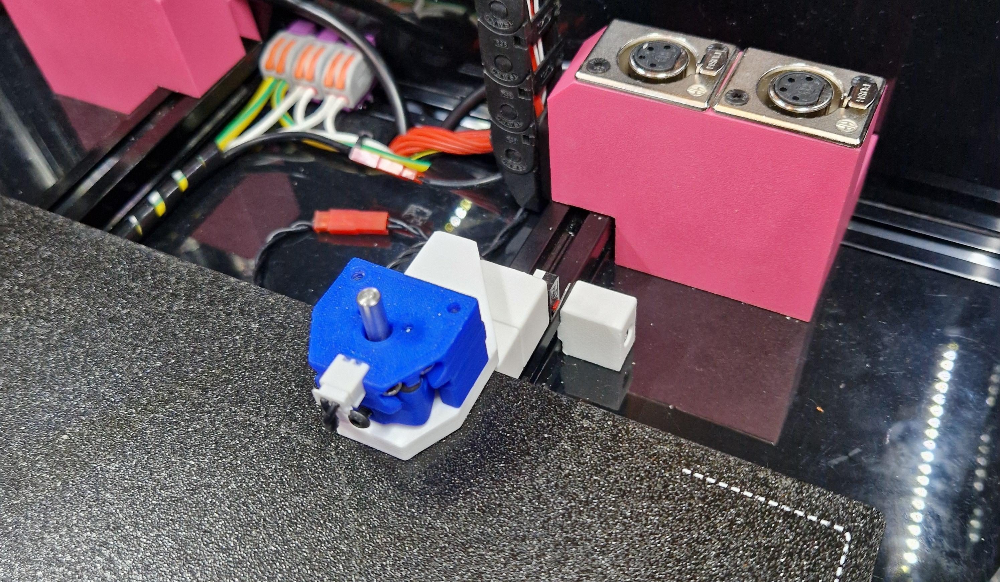
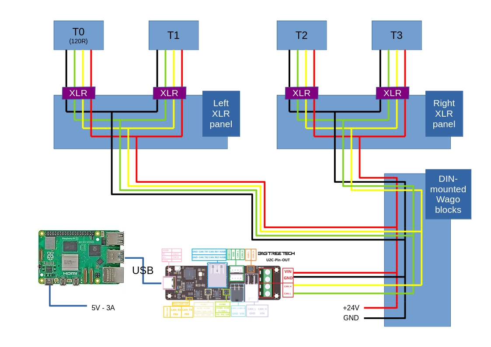

# Assembly Guide

## 1. Tools

- Hex drivers

- Soldering iron (for the threaded inserts)

- Solder and heat shrinks

- Precision knife

- Metal ruler

## 2. Print parameters

All parts are designed to be print with the following parameters:

- All parts are pre-orientated in the STLs.

- 40% infill

- 4 walls

- ABS or ASA

## 3. Assembly

### 3.1. Dock

#### BOM:

| Quantity | Item                                           |
| -------- | ---------------------------------------------- |
| N/A      | All printed parts in the [Dock](./Dock) folder |
| 10       | M3x16mm bolts                                  |
| 4        | M3x8mm bolts                                   |
| 1        | M3x10mm countersunk bolts                      |
| 13       | M3x5x4mm threaded inserts                      |
| 2        | M3 washers                                     |
| 4        | M2x10mm self-tapping screw                     |
| 2        | M2 washers                                     |
| 4        | 3x20mm rounded pins                            |
| 1        | 0.2mm oven liner cut-out                       |
| 1        | 0.2mm feeler gauge (10mm wide)                 |
| 2        | 10x467mm solid aluminium rods                  |
| 1        | Brass brush                                    |
| 1        | Rubber band                                    |

*Note: the Dock BOM is only for a single dock. Additional docking bay will requires:*

- *(2 of) M3x16mm bolts*

- *(1 of) M3x10mm countersunk bolts*

- *(3 of) M3x5x4mm threaded inserts*

- *(2 of) M2x10mm self-tapping screw*

- *(2 of) M2 washers*

- *(4 of) 3x20mm rounded pins*

- *(1 of) 0.2mm oven liner cut-out*

- *(1 of) 0.2mm feeler gauge (10mm wide)*

#### Steps and note:

* Follow this video guide for the dock assembly: [MissChanger - Build Guide - Dock](https://youtu.be/sSsay7bBFj0)

### 3.2. XLR Panels

#### BOM:

| Quantity | Item                                                                                   |
| -------- | -------------------------------------------------------------------------------------- |
| N/A      | All printed parts in the [XLR_Panels](./XLR_Panels) folder                             |
| 4        | M3x10mm bolts                                                                          |
| 8        | M3x6mm countersunk bolts                                                               |
| 8        | M3x5x4mm threaded inserts                                                              |
| 4        | 4-Pin XLR Female Jack Panel Mount                                                      |
| 2        | WAGO Mounting carrier; 221 Series - 4 mm²; for DIN-35 rail mounting/screw mounting |
| 2        | 221 WAGO 3 Port                                                                        |
| 2        | 221 WAGO 5 Port                                                                        |
| 1m       | CAN bus cable                                                                          |

#### Steps and note:

- TBD

### 3.3. Tool-head and Endstops Assembly

#### BOM:

| Quantity | Item                                                                                                                                                                                                                                                                                                                                                                       |
| -------- | -------------------------------------------------------------------------------------------------------------------------------------------------------------------------------------------------------------------------------------------------------------------------------------------------------------------------------------------------------------------------- |
| N/A      | All printed parts in the [Tap&Change](./Tap&Change) folder                                                                                                                                                                                                                                                                                                                 |
| N/A      | [Voron-Stealthburner](https://github.com/VoronDesign/Voron-Stealthburner) toolhead(s) (Due the complexity of the Stealburner and the number of variants it has, no stl. has been transferred to this repository. Please go to the official Voron repository for those files.) *Note: This guide will assumes that the Stealburner has been built and ready to go.* |
| N/A      | printed parts in the [SB22xx_&_CW2](./SB22xx_&_CW2) folder (only applicable if you are using the Clockwork 2 extruder and the SB22xx toolhead board)                                                                                                                                                                                                                   |
|          |                                                                                                                                                                                                                                                                                                                                                                            |
| 4        | M3 nuts                                                                                                                                                                                                                                                                                                                                                                    |
| 4        | M3x5x4mm threaded inserts                                                                                                                                                                                                                                                                                                                                                  |
| 2        | M3x4.6x3mm threaded inserts                                                                                                                                                                                                                                                                                                                                                |
| 1m       | CAN bus cable                                                                                                                                                                                                                                                                                                                                                              |
| 4        | Sleeve Bearing 3mm Bore x 5mm OD x 5mm Length Plain Bearings                                                                                                                                                                                                                                                                                                               |

#### Steps and note:

* TBD

### 3.4. Calibration Probe

#### BOM:

| Quantity | Item                                                                                                               |
| -------- | ------------------------------------------------------------------------------------------------------------------ |
| N/A      | All printed parts in the [Nudge](./Nudge) folder                                                                   |
| N/A      | [Nudge probe](https://github.com/zruncho3d/nudge) assembly But, use this documentation for software and set up |
| 2        | M3x25mm countersunk bolts                                                                                          |
| 1        | M3x16mm bolts                                                                                                      |
| 2        | M3x20mm bolts                                                                                                      |
| 1        | M3 washers                                                                                                         |
| 2        | M3 T-nuts                                                                                                          |
| 1        | M3x5x4mm threaded inserts                                                                                          |
| 6        | 6x3mm Magnets                                                                                                      |
| 2        | 3x20mm  pins (optional, rounded)                                                                                   |
| 2        | Sleeve Bearing 3mm Bore x 5mm OD x 5mm Length Plain Bearings                                                       |
| 1        | 2 pins connector pair (of whatever type you have)                                                                  |
| 1        | JST male connector                                                                                                 |
| 1m       | 26 AWG wiring                                                                                                      |

#### Steps and note:

* It is important to set up the software using the instruction in this repository (see the README.md in the parent folder of this one)

* Nudge assembly video: [Nudge Probe - Integrated Speedbuild - YouTube](https://youtu.be/6eRomxUo7TI)

* Probe mount assembly:  [MissChanger - Build Guide - Nudge probe mount - YouTube](https://youtu.be/ucKVRpfPakY)

### 3.5. Wiring

In this section, it is assumed that you have already have a working print, i.e. with the controller board connected and working. Therefore, no instruction will be given for the wiring of the controller, SBC, Z-axis motors, etc.

#### CAN bus tool-head wiring diagram:

