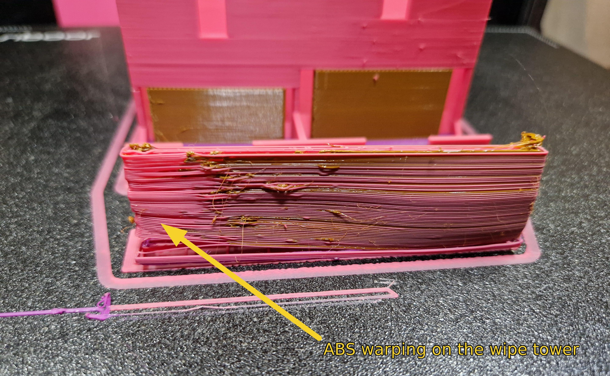

# Material Test

This document aims to outline the lesson learned in trying to combine different materials in a print. It not an exhausted list of the characteristics of the materials, but a list of notes for what material can be combined and tips to get it done.

## Additional sources

1. [Jantec - YouTube](https://youtu.be/KnvEhYCimKc?si=OjUVotaZ15H8OHvi) 

2. [Made with Layers (Thomas Sanladerer) - YouTube](https://youtu.be/5VV2fbJ0apg?si=wMI8C-MYduEpZvwh) 

## General Information

1. The shared resources for all tool-head are: chamber and bed. This limits:
   
   - The material combination. In which, low temp filament cannot be used in a hot chamber. The heated chamber that ABS like to have, 40°C and above, will cause PLA and PETG to soften and clog in the extruder or in cold side of the nozzle.
   
   - The bed temperature have to be a compromised value to fit the materials being combined.
   
   - z-offset on the same tool-head will change depending on whether it is in an enclosure or not, due to thermal expansion of the frame.

2. Due to the order of tool changes in Prusa Slicer, a "PAUSE" operation might happen before the expected layer. This is because the slicer aims to minimise the number of tool changes, it will print the next layer with the currently initialised tool-head first, before tool-change.

3. There is no logic to what the bed temp should be for a multi-material print in the slicer. It just pick that of the first material being extruded.

4. Multi-material with ABS-PLA/PETG is a very un-reliable.

## Combination Matrix

|      | ABS | ASA | PETG | PET | PLA | TPU | PC  |
| ---- | --- | --- | ---- | --- | --- | --- | --- |
| ABS  | n/a | n/a | n/a  | n/a | n/a | n/a | n/a |
| ASA  | 8   | n/a | n/a  | n/a | n/a | n/a | n/a |
| PETG | 3   |     | n/a  | n/a | n/a | n/a | n/a |
| PET  |     |     |      | n/a | n/a | n/a | n/a |
| PLA  | 2   |     | 1    |     | n/a | n/a | n/a |
| TPU  | 6   | 7   | 4    |     | 5   | n/a | n/a |
| PC   |     |     |      |     |     |     | n/a |

### 1 - PLA and PETG

* These two materials are the most accessible material for 3D printing, they can easily be found at very affordable prices around the world.
- PLA and PETG does not chemically stick to each other. This enable:
  
  - Use one to made the support for the other.
  
  - Print-in-place hinges with very tight tolerance. Mechanism with wall-to-wall gap between the parts can go down to 0.15mm. Further reduction in the tolerance can be achieved; however, below 0.15mm the coefficient of friction between the material will start taking it's tow.
* However, there are challenges. The wipe tower needs to be configured for non-chemically compatible:
  
  * The `Wipe tower extruder:` setting (which set the material of the wipe tower shell) should to be set to the tool-head that is responsible for the more stringy material. For example, if you are printing PLA and PETG, you will need to set the tower shell material to PETG. This will allows the material more time and extrusion pressure to stabilise at the tip of the nozzle, without increasing the size and material usage for the wipe tower.
  
  * There are limitations to the way that the wipe tower is done as it is now (09.2024). Since you can only specified a single nozzle as the `Wipe tower extruder:`, if you have 2 PETG nozzles (or any other stringie material) and at least 1 PLA nozzle (a material that is not compatible with the for-mentioned material), at least 1 of the PETG nozzle will have to deal with the risk of priming onto a layer of PLA. If the prime onto the PLA layer fails to adhere, the excess material will blob onto to the nozzle and leads to other problems.

* The normal bed temp for PETG, ~85°C, is too hot for PLA; and that of PLA, ~55°C, is too low for PETG. The solution is to have specific material profiles for the PLA-PETG prints with the same the bed temp at ~75°C, which will allow both to work reasonably well.

### 2 - PLA and ABS

* As shown by [JanTec Engineering](https://www.youtube.com/@JanTecEngineering) in [this  YouTube video](https://youtu.be/KnvEhYCimKc?si=OjUVotaZ15H8OHvi), PLA and ABS adhere relatively well with each other. Even though it is still not as good as ABS-ABS, PLA can still be served as the bottom interface layer for ABS parts. This open the door for PETG support for ABS parts. Nevertheless:
  
  * As PLA-ABS bond is still not as good as ABS-ABS. It is still possible to peel off the PLA-ABS layer by hand.
  
  * The chamber temperature for PLA/PETG is very not ideal for ABS. This leads to warping of parts, and more importantly warping of the wipe tower. Thus, multi-material with ABS-PLA/PETG is a very un-reliable.

* Confictingly [Made with Layers (Thomas Sanladerer) - YouTube](https://www.youtube.com/@MadeWithLayers) shown the opposite result between PLA-and-ABS versus PETG-and-ABS. This might comes down to the specific filament brands.

* The need for a chamber and carbon filter for ABS printing is a large technical challenge to over comes. This is because PLA cannot be print in a chamber of 40°C or above.

### 3 - PETG and ABS

* As shown by [JanTec Engineering](https://www.youtube.com/@JanTecEngineering) in [this YouTube video](https://youtu.be/KnvEhYCimKc?si=OjUVotaZ15H8OHvi), PETG and ABS does adhere with each other, but not as well as PLA-ABS. Coupling the PLA-ABS result above. PETG might be the best support material for ABS, assuming that the chamber temperature challenge can be overcame.
* Confictingly [Made with Layers (Thomas Sanladerer) - YouTube](https://www.youtube.com/@MadeWithLayers) shown the opposite result between PLA-and-ABS versus PETG-and-ABS. This might comes down to the specific filament brands. 
* For the PETG support material. Even though their bond is relatively weak, PETG-ABS bond is still noticeable. It will still be challenging to remove PETG support if it is printed on top of ABS. Thus, it is advised to the make the interface layer between PETG and ABS out of PLA.

### 4 - TPU and PETG

* Very few drawbacks has been observed.

* The key problem is stringing of both materials.

### 5 - TPU and PLA

* Very few drawbacks has been observed.

### 6 - TPU and ABS

* This combination runs into the same problem as PLA and ABS, just at a higher temperature. TPU starts running into heat creep issue at ~40°C and above.

### 7 - TPU and ASA

* Unlike ABS. ASA does not strictly required a hot chamber, and can be printed at 25°C to 35°C, matching that of TPU.

* Very few drawbacks has been observed.

### 8 - ABS and ASA

* These two material are almost identical. They will adhere to each other almost as good adhere to themselves.

* However. The different thermal expansion characteristic of the two materials may cause problems if not accounted for.

## Material Specific

### PLA

1. This is the easiest material to work with.

2. It does not curl (warp) or form fine strings.

3. The speed profile for PLA is difference than that of PETG and other material. The max flow rate is not as high.

4. Heat creep chamber temperature ~35°C or above.
   
   * However, in a chamber at ~35°C it can still be printed in quick pulses, where the nozzle will heat up for a short print, then immediately turn off when docked.

### PETG

1. PETG has a very high tendency to string. this leads to:
   
   * Build up around the nozzle over time. this blob of material would often fails off and get locked into the parts. This material is not ideal for internal parts
   
   * The strings that came out during tool-change can get mechanically locked into the adjacent part.
   
   * **Mitigation 1**, dry filament. This is more important for a tool-changer than it is for single nozzle prints.
   
   * **Mitigation 2**, cleaning. The PETG tool-head will benefit from a nozzle scrub between tool-change.
   
   * **Mitigation 3**, wipe tower. PETG will benefit from additional wipe distance.
   
   * **Mitigation 4**, idle temp. Set an idle temp for this material and enable the "Ooze Prevention" function in the slicer to mitigate the ooze build-up problem.

2. PETG oozing pressure is higher than other materials, partly due to how much moisture it can absorb. The nozzle plug will need to apply pressure to the nozzle to keep the material inside. This is unlike PLA and ABS, where no (or, very little) pressure is needed.

3. PETG lightly sticks to Teflon oven-liner, degrading it over time.

4. This material is much more hydroscopic than ABS and PLA. This even more of a problem for a tool-changer than it is for a single tool-head system, as the material required to start and stop flowing dozen/hundred of times through out the print. Thus, the same spool of PETG that works fine for single material printing may not work at all for multi-material printing.

5. Heat creep chamber temperature ~40°C or above.

6. Maximum volumetric speed ~7 (mm^3/s).

### ABS

1. Warping is a major issue for combining ABS with materials like PLA/PETG. Crucially, this problem will often occur on the wipe tower, making ABS multi-material extremely unreliable.

2. Optimum chamber temperature ~65°C.

3. Heat creep chamber temperature ~70°C or above.

### ASA

1. Heat creep chamber temperature ~70°C or above.

### TPU

1. TPU has a very high tendency to string during retraction. This is very important as there is a big/long retraction between tool changes.

2. Heat creep chamber temperature ~40°C or above.

3. Maximum volumetric speed ~5 (mm^3/s). Due to stringing issues.
